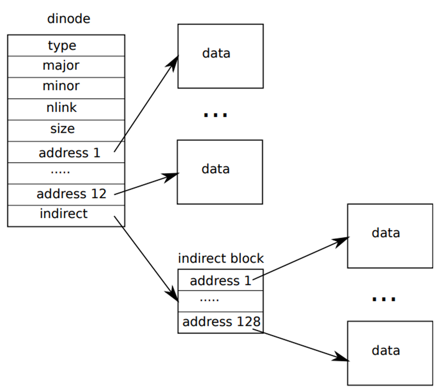

# Lab3: 文件系统

这个实验的标准就是跟 mit 的文件系统差不多了，只不过课上要求的很模糊，老头就说了一句给地址增长一位，然后就啥都不说了

可能是对学生没抱啥希望，所以就觉得只要你能扩展一点点空间就没问题了，不过这不影响你做 mit 的要求

此处照例是把实验代码放到仓库内，注释内包含解释内容；要查看具体效果的方法就是把 Plan 文件夹下的文件进行替换，然后清空编译结果并重新构建即可

本目录下有一个 drawio 图，其画出了两种扩展磁盘的方法，Plan 1 比较简单，Plan 2 稍微有点难度，也是 mit 的要求实现目标。

## 实验提示

在开始实验前你需要了解几个概念、全局定义和相关操作函数：

- `inode`，`dinode` 
  存储一个文件的基本信息，包括存储在哪个设备上，文件编号，文件大小，文件块地址

  这两者之间的区别就是 inode 是位于内存内的，当发生文件操作时，操作系统会根据硬盘上的 dinode 在内存中创建 inode 来表示一个文件，所以 inode 字段比 dinode 的要多。

- 文件块 `block`
  别名磁盘扇区。用于表示一个在磁盘上的块，每个文件都以数个这样的块存储在硬盘上。在 xv6 中块 (`BSIZE`) 的大小是 512 Bytes，而 windows 操作系统一般是 4kb，你可以新建一个文件，然后右键属性查看这个文件的属性，看占用空间一栏就知道操作系统的块大小是多少了。

  这也意味着每个文件最小的占用空间是一个块的大小。

- 文件块地址 `addrs`
  他是一个数组，你可以在两个 inode 结构体里面找到，他用于表示这个文件所使用的每个文件块的地址，解引用该地址并读取后就能获得其在硬盘/设备上存储的数据。

  其中这个数组又分直接块和间接块，其定义会在接下来解释

- 直接寻址 `NDIRECT`，间接寻址 `NINDIRECT`
  在 xv6 中，文件块地址数组结构如下：

  

  看 address，在 xv6 中，一个文件包含 12 个直接块和一个间接块，这个间接块又指向了 128 个实际文件块。

  因此，前面的 12 个直接块就是直接寻址可以查找到的，而后面的 128 个需要通过一层间接块来查找，这个存储真实文件块地址的间接块也是存在硬盘上的。

- 文件最大可使用文件块数 `MAXFILE`
  代表一个文件可占用的最大文件块数，根据前文提到的，相当于 12 个直接块 + 128 个间接块 = 140，再根据 xv6 每个块大小为 512 Bytes 可知一个文件最大的大小是 70kb，这比现代操作系统要小得多，本次实验的目的就是扩展每个文件可使用的文件块数量上限。

- 文件系统块数量 `FSSIZE`
  用于告诉操作系统当前操作系统文件系统块最大数量，该值被设置成了 1000，非常小，所以你在做实验的时候需要改上限，至少改到 2000，如果是超大文件则需要改到 10w.

- 你需要修改的函数
  - bmap: 该函数可以将文件块号映射到真实磁盘位置
  - itrunc: 该函数会在一个文件被删除时调用

- 可能出现的bug
  - 每次修改文件系统相关函数和宏定义变量后，你可能需要 `make clean` 后再启动操作系统，因为文件系统可能会使用到你修改的宏定义进行文件处理和查询
  - 假如发生了某个 assert 错误，可能是你的 inode 或 dinode 在扩展文件块时没有将该结构体内存大小与磁盘块 512 Bytes 对齐，这常见于你忘记牺牲一个直接地址来存储一个更大的间接地址块的情况。

## 实验目标

提升一个文件的存储上限，能扩展到 267 个块就是有扩展思路，85昏；能扩展到 16523 个块就是超级满分了。
